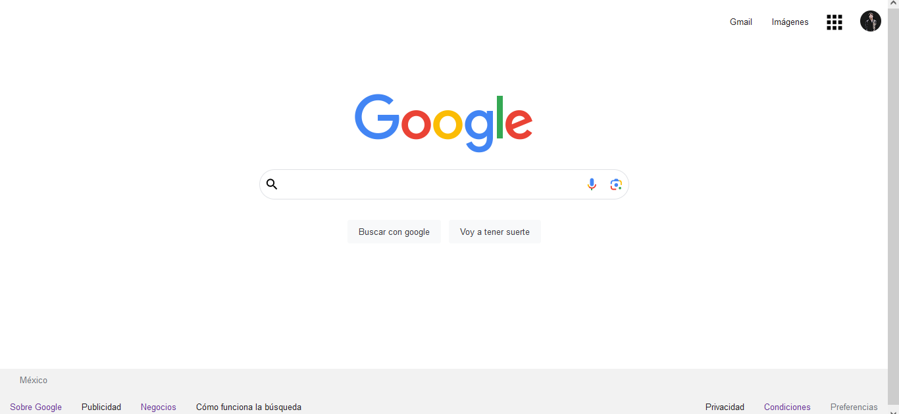

# Clon de Gooogle (HTML,CSS)

Proyecto realizado con la intención de aplicar los conocimientos obtenidos en el bootcamp de Tecnolochicas PRO Summer Camp 2023.

Puedes poner en práctica tus habilidadees revisando y utilizando el código a continuacion.

## ÍNDICE

* [1. Intro](https://github.com/EsmeraldaFloreSK/clon-de-google#1intro)
 * [2. Demo](url)
*  [3. ¿Qué construiras?](url)
*  [4.Objetivos de aprendizaje](url)
*  [5.Requisitos](url)

***
## 1.Intro

HTML trabaja de la mano con CSS para crear las páginas web que usamos todos los días en el navegador💻. Incluso, este sitio web en donde estás viendo este contenido está construido con HTML y CSS🤯 (junto con otros elementos que conocerás más adelante). Para este primer proyecto, con los conocimientos que tienes de HTML y CSS realizarás la clonación de la interfaz de Google, sí, esa que ves cada que haces una búsqueda en su navegador, ¿aceptas el reto🤓?

## 2.Demo

Puedes entrar a ver el demo en este vinculo: https://main--preeminent-blancmange-87194c.netlify.app/

La idea es inspirarte con esta demostración de proyecto. 

**¡Quizá no te quede idéntico o quizá te quede mucho mejor que este demo🤩**, utiliza tu destreza y aprendizaje para que demuestres que tu futuro es ser un(a) programador(a) web.👩🏻💻👦🏻

## 3.¿Qué construiras?

Este proyecto está enfocado en construir la interfaz estática de Google:

Se te pide que sea una sola página que contenga las siiguientes secciones:
 - **a. Header**
  Sección que involucra la foto de perfil,iconos, logo de Google y las áreas principales del sitio.
- **b. Main**
  Sección del contenedor para los elementos centrales de la página.
- **c. Foster**
  Sección que incluye hipervínculos al final de la página.

****

## 4. Objetivos de aprendizaje

